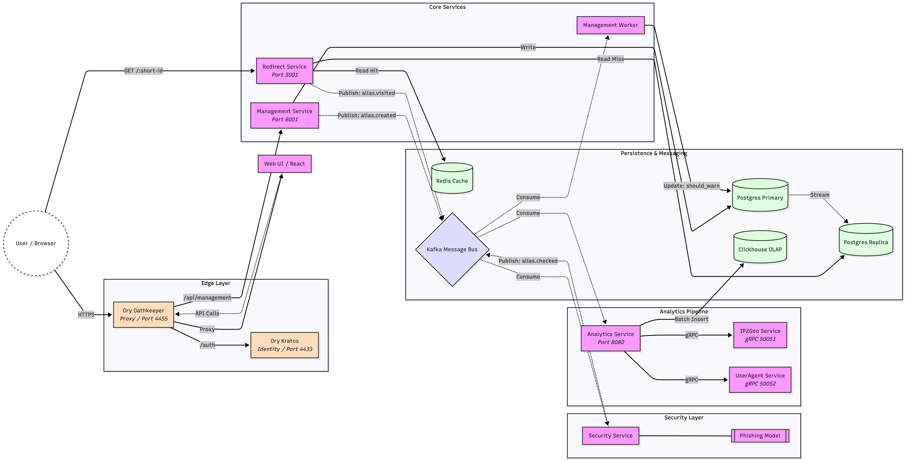

# Welcome to URL2Short



This is URL2Short, a high-performance, scalable URL shortener built to handle high traffic and provide real-time insights. Think of it as your own personal Bitly, but open-source and built with modern tech.

## What is this?

It is a system that takes long URLs and turns them into short, shareable links. But it does more than just shorten links:
*   **Fast:** We use Redis caching to make sure redirects happen instantly.
*   **Smart:** It tracks who clicks your links (browser, country, OS) without slowing down the user.
*   **Scalable:** Built with microservices, so you can scale the parts that need it most.

## Under the Hood

We have broken things down into small, focused services so everything runs smoothly:

*   **Management API** (TypeScript): The brain. It handles creating links and managing your account.
*   **Redirect Service** (TypeScript): The traffic cop. It sends users where they need to go, super fast.
*   **Analytics Service** (Go): The data cruncher. It quietly records every click and gives you detailed stats.
*   **The Glue**: We use **Kafka** to send messages between services and **ClickHouse** to store massive amounts of analytics data.

## Getting Started

Want to take it for a spin? It is easy.

For a detailed guide on running the application locally or via Docker, please see [Running Instructions](docs/RUNNING.md).

### You Will Need
*   Docker & Docker Compose (to run everything)
*   Bun (if you want to hack on the TS code)
*   Go (if you want to hack on the Analytics code)
*   Python (if you want to hack on the Security code)

### Let's Run It!

1.  **Fire up the engines:**
    ```bash
    docker-compose up -d
    ```
    This might take a minute the first time as it downloads all the necessary parts.

2.  **Access the Web UI:**
    Open [http://localhost:3000](http://localhost:3000) in your browser.

3.  **Create your first link:**
    Use the Web UI or hit the API directly.

## How it Works

1.  **You shorten a link:** The **Management Service** saves it to Postgres and Redis.
2.  **Someone clicks it:** The **Redirect Service** looks it up in Redis (super fast!) and sends them to the real URL.
3.  **Behind the scenes:** The Redirect Service also sends a message to **Kafka**: "Someone just clicked link XYZ!"
4.  **Data processing:** The **Analytics Service** hears that message, grabs the details, and saves it to **ClickHouse**.
5.  **You check stats:** You ask the API, and it pulls the data from ClickHouse to show you who clicked.

## Tech Stack

*   **Languages:** TypeScript (Bun), Go
*   **Databases:** Postgres, ClickHouse, Redis
*   **Messaging:** Kafka
*   **Frontend:** React + Vite

Enjoy sharing those short links!
